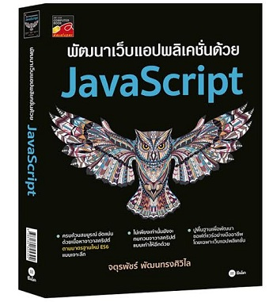
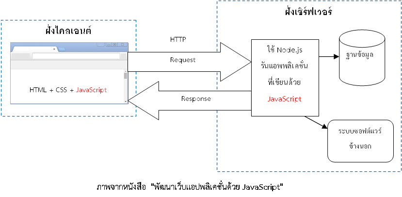
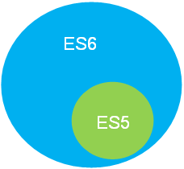
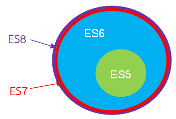
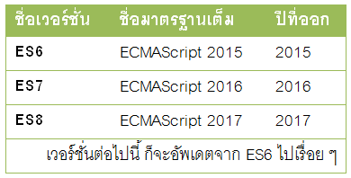

# สรุปเนื้อหาจากหนังสือ  "พัฒนาเว็บแอปพลิเคชั่นด้วย JavaScript"



## เนื้อหาเกี่ยวกับอะไร

เนื้อหาทั้งหมดต่อไปนี้จะสรุปเกี่ยวกับภาษาจาวาสคริปต์ (JavaScript)  ยุคสมัยใหม่ตามมาตรฐาน ES6 จากหนังสือที่เห็นในรูปข้างต้นครับ รวมทั้งเพิ่มเนื้อหาที่ไม่อยู่ในหนังสือ เช่น ES7 และอื่นๆ อีกมากมาย ซึ่งตอนนี้ผมยังเขียนสรุปไม่เสร็จดี (เสร็จไปแค่ 1 %) ว่างๆ ก็จะมาอัพเดตใหม่เรื่อยๆ

## ถ้าสนใจเล่มนี้สามารถสั่งซื้อได้ที่

* [ศูนย์หนังสือจุฬา]( http://www.chulabook.com/description.asp?barcode=9786160825394)
* [ร้านนายอินทร์](https://www.naiin.com/product/detail/191081/)
* [ร้าน Book Smile](http://www.booksmile.co.th/คอมพิวเตอร์อินเทอร์เน็ต/พัฒนาเว็บแอบพลิเคชั่นด้วย-JavaScript.html)
* [ร้าน kinokuniya thailand](https://thailand.kinokuniya.com/bw/9786160825394)
* [ซีเอ็ดบางสาขา]( https://www.se-ed.com/product/พัฒนาเว็บแอปพลิเคชั่นด้วย-JavaScript.aspx?no=9786160825394)
* และร้านหนังสืออื่น ๆ ที่ไม่ได้กล่าว

## สารบัญ

* [Quick start](#quick-start)
* [Bugs and feature requests](#bugs-and-feature-requests)
* [Documentation](#documentation)
* [Contributing](#contributing)
* [Community](#community)
* [Versioning](#versioning)
* [Creators](#creators)
* [Copyright and license](#copyright-and-license)

## บทที่ 1 แนะนำภาษาจาวาสคริปต์

ภาษาจาวาสคริปต์ (JavaScript) เป็นภาษาโปรแกรมเชิงวัตถุแบบไดนามิกไทป์ (Dynamic types) ซึ่งไวยากรณ์ของมันได้นำโครงสร้างมาจากภาษายอดนิยมอย่างจาวา (Java) กับภาษาซี (C) 

โปรแกรมที่เขียนขึ้นด้วยจาวาสคริปต์ จะต้องทำงานอยู่บนจาวาสคริปต์เอ็นจิ้น (JavaScript engine) ที่เป็นทั้งตัวแปลภาษา (Interpreter) และใช้รันโปรแกรม สำหรับการทำงานของจาวาสคริปต์ที่เราคุ้นเคยกันดี จะทำงานอยู่บนเว็บเบราเซอร์ เช่น Google Chrome, Firefox และ Internet Explorer เป็นต้น ซึ่งจะมีจาวาสคริปต์เอ็นจิ้นติดตั้งมาให้อยู่แล้ว

### ให้ความรู้เพิ่มเติมนิดหนึ่ง เผื่อคนไม่รู้จักภาษา JavaScript

* นักพัฒนาซอฟต์แวร์ส่วนใหญ่ล้วนรู้จักภาษาจาวาสคริปต์ ซึ่งถือว่านิยมใช้กันมากภาษาหนึ่งในโลก ถ้าศึกษาอย่างผิวเผินก็อาจคิดว่าง๊ายง่าย แต่เมื่อศึกษาลงลึก ๆ แล้ว จะพบว่ามันโคตรจะอินดี้ เป็นภาษาปราบเซียนตัวหนึ่ง จนคนไม่ค่อยเข้าใจกันมากเท่าไรนัก จนหารู้ไม่ว่ามันมีความสามารถแฝงที่ซ้อนเร้นอยู่เยอะเลย
* จาวาสคริปต์ไม่ใช่ภาษา Java นะครับ คนละภาษา (คนมักสับสนกัน) 


* คนส่วนใหญ่รู้แค่ว่าใช้จาวาสคริปต์ร่วมกับภาษา HTML (ปัจจุบันเวอร์ชั่น HTML5) กับ CSS (ปัจจุบันเวอร์ชั่น CSS3) เพื่อทำให้เว็บมันไดนามิก ฟุ้งฟิ้ง กรุ้งกิ๊ง (มันดังในฝั่ง Font-end มานาน)
* แต่ปัจจุบันนี้จาวาสคริปต์สมัยใหม่ มันก้าวหน้าไปไกลมาก ๆๆๆ เพราะสามารถทำงานอยู่ฝั่งเซิร์ฟเวอร์ได้ (Back-end) ด้วย Node.js แม้แต่เอาไปทำแอพบนโมบาย หรือแม้แต่โรบอท ก็ยังทำได้ด้วย ….อายย่ะ



* ES6 (ECMAScript 2015) เป็นมาตรฐานใหม่ล่าสุดของจาวาสคริปต์ ประกาศออกมาเมื่อกลางเดือนมิถุนายนปี 2558 ซึ่งถือว่าเปลี่ยนแปลงเวอร์ชั่นครั้งใหญ่สุดในประวัติศาสตร์ของภาษานี้ หลังจากไม่ได้เปลี่ยนมาเกือบ 6 ปี (เวอร์ชั่นเก่าคือ ES5)



* ปีค.ศ. 2016 เวอร์ชั่นใหม่ ES7 (ECMAScript 2016) ก็ออกมาแหละ ส่วนปีหน้า 2017 ก็จะเป็นคิวของเวอร์ชั่น ES8 (ECMAScript 2017) จะออกมาเช่นกัน 
* ต้องเข้าใจอย่างนี้นะครัช เนื่อง ES6 มันใหญ่โตอลังการงานสร้างมาก คืนรอปล่อยออกมาหมดทีเดียว ก็คงรอหลายชาติภพ อาจทำให้มีเสียงบ่นตามมาได้ ด้วยเหตุนี้เข้าถึงเพิ่มฟีเจอร์เล็กยิบ ๆ ย่อย ๆ มาใส่ไว้ในเวอร์ชั่นหลัง ๆ แทน 
* โดยคาดว่าจากนี้ไป จะมีการประกาศเวอร์ชั่นใหม่ทุก ๆ ปี โดยให้คิดเสียว่า ES6 เหมือนโปรแกรมหลัก ส่วนเวอร์ชั่นที่ออกตามทีหลัง ไม่ได้ว่าจะเป็น ES7, ES8 และ ESXXXXX มันก็คือการอัพเดตซอฟต์แวร์ อะไรประมาณนี้



* API ที่ใช้ติดต่อกับ DOM หรือใช้งานร่วมกับ HTML5, CSS3 ใน ES6 เขาไม่ได้เปลี่ยนแปลงอะไรเลย
* ES6,ES7,ES8 มันเป็นแค่มาตรฐานใหม่สด ๆ ซิง ๆ ดังนั้นการใช้งานโดยตรงบนเว็บบราวเซอร์ (ปัจจุบันที่ผมเขียนอยู่นี้) ก็ยังไม่ support ทุกฟีเจอร์ ต้องมีตัวคอมไพล์ช่วยก่อน (ยังมีข้อจำกัดบางประการ) …หรือถ้าใครใช้ Node.js เวอร์ชั่น 6 ก็ยังรองรับ ES6 ได้แค่ 93 % (ES7 รองรับได้บางส่วน)



```js
var colors = ["red", "green", "blue"];

for (var i = 0, len = colors.length; i < len; i++) {
    console.log(colors[i]);
}
```

## Node.js
