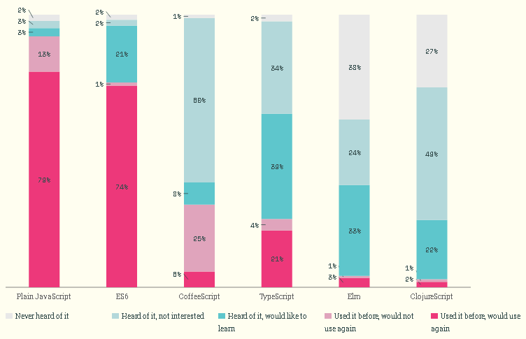
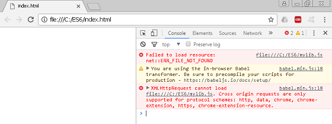
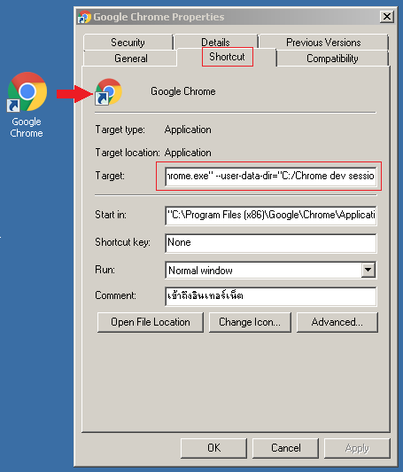
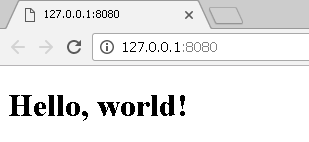
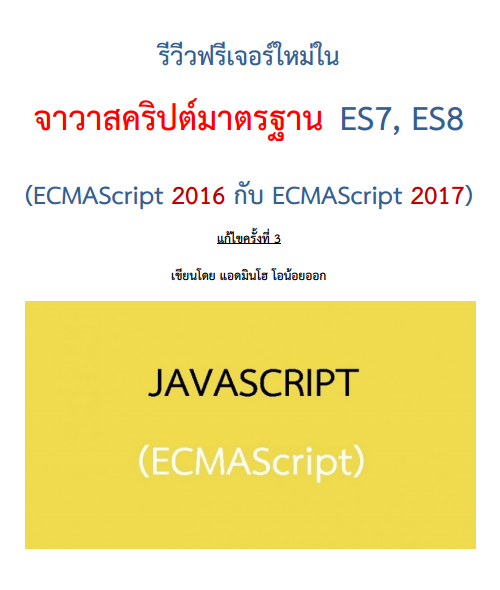

# มาเรียนรู้ JavaScript ยุคสมัยใหม่กันเถอะ! 


## สารบัญ

* [แนะนำภาษาจาวาสคริปต์](#แนะนำภาษาจาวาสคริปต์)
* [ทวน ES5 (มาตรฐานเก่า)](#ทวน-es5-มาตรฐานเก่า)
* [แนะนำ ES6](#แนะนำ-es6)
* [แนะนำ ES7](#แนะนำ-es7)
* [แนะนำ ES8](#แนะนำ-es8)
* [แนะนำ ES9 และ ES10](#แนะนำ-es9-และ-es10)

## แนะนำภาษาจาวาสคริปต์

### เกริ่นนำ

* ภาษาจาวาสคริปต์ (JavaScript) เป็นภาษาโปรแกรมเชิงวัตถุแบบไดนามิกไทป์ (Dynamic types) ซึ่งไวยากรณ์ของมันได้นำโครงสร้างมาจากภาษายอดนิยมอย่างจาวา (Java) กับภาษาซี (C) 

* โปรแกรมที่เขียนขึ้นด้วยจาวาสคริปต์ จะต้องทำงานอยู่บนจาวาสคริปต์เอ็นจิ้น (JavaScript engine) ที่เป็นทั้งตัวแปลภาษา (Interpreter) และใช้รันโปรแกรม สำหรับการทำงานของจาวาสคริปต์ที่เราคุ้นเคยกันดี จะทำงานอยู่บนเว็บเบราเซอร์ เช่น Google Chrome, Firefox และ Internet Explorer เป็นต้น ซึ่งจะมีจาวาสคริปต์เอ็นจิ้นติดตั้งมาให้อยู่แล้ว


* นักพัฒนาซอฟต์แวร์ส่วนใหญ่ล้วนรู้จักภาษาจาวาสคริปต์ ซึ่งถือว่านิยมใช้กันมากภาษาหนึ่งในโลก ถ้าศึกษาอย่างผิวเผินก็อาจคิดว่าง๊ายง่าย แต่เมื่อศึกษาลงลึก ๆ แล้ว จะพบว่ามัน**โคตรจะอินดี้ เป็นภาษาปราบเซียนตัวหนึ่ง** จนคนไม่ค่อยเข้าใจกันมากเท่าไรนัก จนหารู้ไม่ว่ามันมีความสามารถแฝงที่ซ้อนเร้นอยู่เยอะเลย

* จาวาสคริปต์ไม่ใช่ภาษา Java นะครับ คนละภาษา (คนมักสับสนกัน) 


* คนส่วนใหญ่รู้แค่ว่าใช้จาวาสคริปต์ร่วมกับภาษา HTML (ปัจจุบันเวอร์ชั่น HTML5.1) กับ CSS (ปัจจุบันเวอร์ชั่น CSS3) เพื่อทำให้เว็บมันไดนามิก ฟุ้งฟิ้ง กรุ้งกิ๊ง (มันดังในฝั่ง Font-end มานาน)

* แต่ปัจจุบันนี้จาวาสคริปต์สมัยใหม่ มันก้าวหน้าไปไกลมาก ๆๆๆ เพราะสามารถทำงานอยู่ฝั่งเซิร์ฟเวอร์ได้ (Back-end) ด้วย Node.js แม้แต่เอาไปทำแอพบนโมบาย หรือแม้แต่โรบอท ก็ยังทำได้ด้วย ….อายย่ะ


* องค์กร Ecma International (องค์กรจัดการมาตรฐานแห่งยุโรป) เป็นผู้กำหนดมาตรฐานจาวาสคริปต์ ซึ่งจะเรียกมาตรฐานนี้ว่า “ECMA-262” ส่วนตัวภาษาจาวาสคริปต์นั้น ก็จะมีชื่อเรียกเต็มยศอย่างเป็นทางการว่า “ภาษา ECMAScript“


* ES6 (ECMAScript 2015) เป็นมาตรฐานใหม่ล่าสุดของจาวาสคริปต์ ประกาศออกมาเมื่อกลางเดือนมิถุนายนปี 2558 ซึ่งถือว่าเปลี่ยนแปลงเวอร์ชั่นครั้งใหญ่สุดในประวัติศาสตร์ของภาษานี้ หลังจากไม่ได้เปลี่ยนมาเกือบ 6 ปี (เวอร์ชั่นเก่าคือ ES5)


* ปีค.ศ. 2016 เวอร์ชั่นใหม่ ES7 (ECMAScript 2016) ก็ออกมาแหละ ส่วนปีหน้า 2017 ก็จะเป็นคิวของเวอร์ชั่น ES8 (ECMAScript 2017) จะออกมาเช่นกัน 

* ต้องเข้าใจอย่างนี้นะครัช เนื่อง ES6 มันใหญ่โตอลังการงานสร้างมาก คืนรอปล่อยออกมาหมดทีเดียว ก็คงรอหลายชาติภพ อาจทำให้มีเสียงบ่นตามมาได้ ด้วยเหตุนี้เข้าถึงเพิ่มฟีเจอร์เล็กยิบ ๆ ย่อย ๆ มาใส่ไว้ในเวอร์ชั่นหลัง ๆ แทน 

* โดยคาดว่าจากนี้ไป จะมีการประกาศเวอร์ชั่นใหม่ทุก ๆ ปี โดยให้คิดเสียว่า ES6 เหมือนโปรแกรมหลัก ส่วนเวอร์ชั่นที่ออกตามทีหลัง ไม่ได้ว่าจะเป็น ES7, ES8 และ ESXXXXX __(ถ้ามีต่อนะ)__ มันก็คือการอัพเดตซอฟต์แวร์ อะไรประมาณนี้


* API ที่ใช้ติดต่อกับ DOM หรือใช้งานร่วมกับ HTML5.1, CSS3 ใน ES6 เขาไม่ได้เปลี่ยนแปลงอะไรเลย

* ES6, ES7, ES8 มันเป็นแค่มาตรฐานใหม่สด ๆ ซิง ๆ ดังนั้นการใช้งานโดยตรงบนเว็บบราวเซอร์ (ปัจจุบันที่ผมเขียนอยู่นี้) ก็ยังไม่ support ทุกฟีเจอร์ ต้องมีตัวคอมไพล์ช่วยก่อน (ยังมีข้อจำกัดบางประการ) …แต่ถ้าใครใช้ Node.js เวอร์ชั่น 7 ก็จะรองรับ ES6 ได้ 99% 


* TypeScript เป็นภาษาดัดแปลงมาจากจาวาสคริปต์ โดยทั้งนี้ไวยากรณ์และฟีเจอร์ต่างๆ จะมากกว่า อาจมองว่าเป็นซุปเปอร์เซตของจาวาสคริปต์อีกที (แน่นอนมันครอบคลุม ES6) ซึ่งเจ้าของภาษาคือ Microsoft


### ลองมาดูความนิยมของ ES6 กัน



จากรูปเป็นผลสำรวจปี 2016 จะเห็นว่ามาตรฐานใหม่ ES6 คนเริ่มใช้งานเยอะ ไล่จี้จาวาสคริปต์แบบเก่าติดๆ แล้ว (ES5)

(ที่มา http://stateofjs.com/2016/flavors/)

### เครื่องมือในการพัฒนาจาวาสคริปต์ (IDE)

* มีให้ใช้ฟรีหลายตัวมาก เช่น Visual Studio Code, Sublime Text, Atom, Free JavaScript Editor, Aptana Studio, NetBeans, Eclipse ฯลฯ 
* หรือแม้แต่ใช้อิดิเตอร์ (Editor) ธรรมดา เช่น Notepad, Notepad++ และ EditPlus เป็นต้น 
* หรือถ้าเป็น geek หน่อย ก็จะใช้ Text Editor อย่าง Vim, Emacs เป็นต้น


### Node.js มันคืออะไรตับไตใส้พุง?

ถ้าใครจับจาวาสคริปต์ยุคนี้ จะหนีไม่พ้นต้องรู้จัก Node.js …เอ๊ะ ว่าแต่มันคืออะไรล่ะ?

ถ้าอธิบายสั้นๆ มันคือตัวรันไทม์ (Runtime) ของภาษาจาวาสคริปต์ โดยที่เราไม่ต้องพึ่งพาเว็บบราวเซอร์เลย 

ด้วยเหตุนี้จึงสามารถรันจาวาสคริปต์นอกเว็บเบราเซอร์ได้ ซึ่งปัจจุบันเขานิยมนำ Node.js มาใช้งานฝั่งเซิร์ฟเวอร์ (Back-end) หรือจะทำงานตามลำพังเป็นแบบ Standalone ก็ย่อมได้นะลูกพี่

ถ้าสนใจเนื้อหาของ Node.js มากกว่านี้ ก็สามารถอ่าน ebook ที่ผมแจกฟรีได้ที่

* [วิธีติดตั้ง Node.js และ npm เบื้องต้น (Node.js เวอร์ชั่น 6)](http://ebooks.in.th/ebook/37385/วิธีติดตั้ง_Node.js_และ_npm_เบื้องต้น/)
* [Node.js เล่ม 1](http://www.ebooks.in.th/ebook/37714/เสียดายไม่ได้อ่าน_จาวาสคริปต์ฝั่งเซิร์ฟเวอร์_Node.js_(ฉบับย่อ)/)
* [Node.js เล่ม  2] (http://www.ebooks.in.th/ebook/37836/เสียดายไม่ได้อ่าน_จาวาสคริปต์ฝั่งเซิร์ฟเวอร์_Node.js_ฉบับย่อ_เล่ม2)
* [การใช้งาน MongoDB เบื้องต้น (แถมให้อีกอัน)](http://www.ebooks.in.th/ebook/37861/การใช้งาน_MongoDB_เบื้องต้น/)

*** ต้องสมัครเป็นสมาชิกของ http://www.ebooks.in.th ถึงจะโหลด PDF ได้


* เล่มอื่นเผื่อใครสนใจ http://www.ebooks.in.th/adminho/


###  ตัวอย่างจาวาสคริปต์บนเว็บเบราเซอร์ 

ตัวอย่างต่อไปนี้จะแสดงการเขียนจาวาสคริปต์ตามมาตรฐานเก่า ES5 ซึ่งจะต้องแทรกอยู่ภายใต้แท็ก < script > ...< /script > ของไฟล์ HTML โดยทั้งนี้จะสมมติว่าบันทึกเป็นไฟล์ index.html

*** ผมขอติ้งต่างว่า คุณเขียนจาวาสคริปต์บน HTML เป็นกันอยู่แล้วเนอะ

```js
<!-- ไฟล์ชื่อ index.html-->
<!DOCTYPE html>
<html>
<head></head>
<body>
	<h1 id="element1"></h1>
	<script>		
		// ซอร์สโค้ดตามมาตราฐานเก่า ES5   
		function say(message){
	    		var element = document.querySelector('#element1');
	    		element.innerHTML = message;			
		}
		say("Hello, world!");
</script>
</body>
</html>
```

โครงสร้างโปรเจค

```js
C:\ES6>
    |-- index.html
```

เมื่อดับเบิลคลิกที่ไฟล์ index.html จะปรากฏตามรูป


### ตัวอย่างจาวาสคริปต์นอกเว็บเบราเซอร์

ต่อไปจะแสดงการใช้งานจาวาสคริปต์นอกเว็บเบราเซอร์ ด้วยการใช้ Node.js รันไฟล์จาวาสคริปต์ในฝั่งเซิร์ฟเวอร์

```js
var http = require('http');

http.createServer(function (request, response) {
  response.writeHead(200, {'Content-Type': 'text/plain'});
  response.end("Hello, world!");
}).listen(8001, '127.0.0.1');

console.log('Server running at http://127.0.0.1:8001/');
```

ซอร์สโค้ดข้างบน อย่าเพิ่งสนใจรายละเอียดนะครับ (มันนอกประเด็น) แต่จะสมว่าบันทึกเป็นไฟล์ server.js ดังโครงสร้างโปรเจคต่อไปนี้

```js
C:\ES6>
    |-- server.js
```

รันไฟล์ server.js ผ่านทาง Node.js ด้วยความสั่งต่อไปนี้  ตามรูป


*** อ่านวิธีติดตั้ง และใช้งาน Node.js เพิ่มเติม ได้จากหนังสือที่ผมแจกฟรีข้างต้นนะครับ

เมื่อเปิดเว็บเบราเซอร์แล้วกรอก URL เป็น http://127.0.0.1:8001/ ก็จะเห็นข้อความ Hello, world! แสดงออกมาทางหน้าเว็บเพจ ตามรูป


### ตัวอย่างการเขียน ES6 กับ ES7 บนเว็บเบราเซอร์

เนื่องจากเว็บเบราเซอร์ส่วนใหญ่จะใช้งานได้กับ ES5 ด้วยเหตุนี้จึงต้องนำซอร์สโค้ดที่เขียนด้วย ES6 มาคอมไพล์ ด้วยคอมไพเลอร์ที่เรียกว่า “transpiler” เพื่อแปลงจาก ES6 ให้กลายมาเป็นเวอร์ชั่น ES5 ที่เว็บเบราเซอร์ส่วนใหญ่ใช้งานได้ไปก่อน

#### Traceur

โดยตัวอย่างต่อไปนี้จะแสดงการเขียนจาวาสคริปต์บนเว็บเบราเซอร์ โดยใช้ Traceur ทำตัวเป็น transpiler (อย่าเพิ่งสนใจรายละเอียดซอร์สโค้ดที่ยกมาให้ดูนะครับ)

```js
<!-- ไฟล์ index.html-->
<!DOCTYPE html>
<html>
<head>

<!--  Traceur (ใช้เป็นตัว transpiler)-->
<script src="https://google.github.io/traceur-compiler/bin/traceur.js"></script>
<script src="https://google.github.io/traceur-compiler/bin/BrowserSystem.js"></script>
<script src="https://google.github.io/traceur-compiler/src/bootstrap.js"></script>

</head>
<body>
<h1 id="element1"></h1>
<script type="module">						// ต้องเขียนกำกับ type = "module"
	class Chat{								// class ไวยากรณ์ใหม่ของ ES6
		constructor(message) {				// constructor ไวยากรณ์ใหม่ของ ES6
			this.message = message;
		}
		say(){
			let element = document.querySelector('#element1');
			element.innerHTML = this.message;				
		}
	}		
	let chat = new Chat("Hello, world!");	// let ไวยากรณ์ใหม่ของ ES6
	chat.say();

	// ตัวอย่างโค้ด ES7 ชุดนี้ยังรันได้เฉพาะบน Google Chrome
	let array = ["A", "B", "C"];			// let ไวยากรณ์ใหม่ของ ES6
	console.log(array.includes("A"));   	// true    -- เมธอดของอาร์เรย์ที่เพิ่มเข้ามาใน ES7
</script>
</body>
</html>
```

จะสมมติว่าบันทึกเป็นไฟล์ index.html โดยมีโครงสร้างโปรเจคดังนี้

```js
C:\ES6>
    |-- index.html
```

เมื่อดับเบิลคลิกที่ไฟล์ index.html จะปรากฏตามรูป


สังเกตในโค้ดจะต้องระบุ < script type="module" >

แต่ถ้าจะเขียนโค้ดจาวาสคริปต์ แยกออกมาเป็นไฟล์ .js เช่น mylib.js ก็สามารถทำได้ โดยจะมีโครงสร้างข้างล่าง

```js
C:\ES6>
    |-- index.html
    |-- mylib.js
```

ส่วนไฟล์ mylib.js ก็หน้าตาแบบนี้ไง แค่แยกโค้ดจาวาสคริปต์ออกมา

```js
class Chat{                             // class ไวยากรณ์ใหม่ของ ES6
    constructor(message) {              // constructor ไวยากรณ์ใหม่ของ ES6
        this.message = message;
    }
    say(){
        let element = document.querySelector('#element1');
        element.innerHTML = this.message;               
    }
}       

let chat = new Chat("Hello, world!");   // let ไวยากรณ์ใหม่ของ ES6
chat.say();

// ตัวอย่างโค้ด ES7 ชุดนี้ยังรันได้เฉพาะบน Google Chrome
let array = ["A", "B", "C"];            // let ไวยากรณ์ใหม่ของ ES6
console.log(array.includes("A"));       // true    -- เมธอดของอาร์เรย์ที่เพิ่มเข้ามาใน ES7
```

สามารถเขียนอ้างไฟล์ .js ได้ง่ายๆ ดังนี้

```js
<!-- ไฟล์ index.html-->
<!DOCTYPE html>
<html>
<head>

<!--  Traceur (ใช้เป็นตัว transpiler)-->
<script src="https://google.github.io/traceur-compiler/bin/traceur.js"></script>
<script src="https://google.github.io/traceur-compiler/bin/BrowserSystem.js"></script>
<script src="https://google.github.io/traceur-compiler/src/bootstrap.js"></script>

</head>
<body>
<h1 id="element1"></h1>

<script type="module">
import "./mylib.js";  	// อ้างไฟล์ .js
</script>

</body>
</html>
```

**หมายเหต** วิธีอิมพอร์ตไฟล์ด้วยวิธีนี้ ถ้าไปเปิดดูบน Google Chrome อาจไม่ทำงาน แต่ไม่ต้องซีเรียส เรามีทางแก้ไข แนะนำให้ไปอ่านหัวข้อ [Cross-origin resource sharing (CORS)] (#cross-origin-resource-sharing-cors)

#### Babel

ต่อไปจะแสดงการเขียนจาวาสคริปต์บนเว็บเบราเซอร์ โดยใช้ Babel ทำตัวเป็น transpiler (ผลการทำงานจะเหมือนตัวอย่างตอนใช้ Traceur )

```js
<!-- ไฟล์ index.html-->
<!DOCTYPE html>
<html>
<head>

<!--  Babel (ใช้เป็นตัว transpiler)-->
<script src="https://cdnjs.cloudflare.com/ajax/libs/babel-standalone/6.14.0/babel.min.js"></script>

</head>
<body>
<h1 id="element1"></h1>
<script type="text/babel">					// ต้องเขียนกำกับ type = "text/babel"
	class Chat{								// class ไวยากรณ์ใหม่ของ ES6
		constructor(message) {				// constructor ไวยากรณ์ใหม่ของ ES6
			this.message = message;
		}
		say(){
			let element = document.querySelector('#element1');
			element.innerHTML = this.message;				
		}
	}		
	let chat = new Chat("Hello, world!");	// let ไวยากรณ์ใหม่ของ ES6
	chat.say();

	// ตัวอย่างโค้ด ES7 ชุดนี้ยังรันได้เฉพาะบน Google Chrome
	let array = ["A", "B", "C"];			// let ไวยากรณ์ใหม่ของ ES6
	console.log(array.includes("A"));   	// true    -- เมธอดของอาร์เรย์ที่เพิ่มเข้ามาใน ES7
</script>
</body>
</html>
```

จะสมมติว่าบันทึกเป็นไฟล์ index.html โดยมีโครงสร้างโปรเจคดังนี้

```js
C:\ES6>
    |-- index.html
```

เมื่อดับเบิลคลิกที่ไฟล์ index.html จะปรากฏตามรูป


สังเกตในโค้ดจะต้องระบุ < script type="text/babel" > หรือเขียนเป็น < script type="text/jsx" > ก็ได้เหมือนกัน

แต่ถ้าจะเขียนโค้ดจาวาสคริปต์ แยกออกมาเป็นไฟล์ .js เช่น mylib.js ก็สามารถทำได้ โดยจะมีโครงสร้างข้างล่าง (ไฟล์ .js หน้าตาเหมือนตอนใช้ Traceur)

```js
C:\ES6>
    |-- index.html
    |-- mylib.js
```

สามารถเขียนอ้างไฟล์ .js ได้ง่ายๆ ดังนี้ (สังเกตโค้ดดีๆ วิธีอิมพอร์ตไฟล์ .js จะต่างกับ Traceur เล็กน้อย)

```js
<!-- ไฟล์ index.html-->
<!DOCTYPE html>
<html>
<head>

<!--  Babel (ใช้เป็นตัว transpiler)-->
<script src="https://cdnjs.cloudflare.com/ajax/libs/babel-standalone/6.14.0/babel.min.js"></script>

</head>
<body>
<h1 id="element1"></h1>
<script type="text/babel" src="mylib.js">	// อ้างไฟล์ .js
</script>
</body>
</html>
```

**หมายเหต** วิธีอิมพอร์ตไฟล์ด้วยวิธีนี้ ถ้าไปเปิดดูบน Google Chrome อาจไม่ทำงาน แต่ไม่ต้องซีเรียส เรามีทางแก้ไข แนะนำให้ไปอ่านหัวข้อ [Cross-origin resource sharing (CORS)] (#cross-origin-resource-sharing-cors)

### โหลดไฟล์ Traceur กับ Babel มาเก็บไว้ที่เครื่องแบบออฟไลน์

#### Traceur แบบออฟไลน์

จากตัวอย่างก่อนๆ เวลาเขียน ES6 กับ ES7 บนว็บบราวเซอร์ด้วย Traceur ผมต้องอ้างถึงไฟล์ traceur.js, BrowserSystem.js และ bootstrap.js แบบออนไลน์ แต่ถ้าจะโหลดไฟล์นี้ (ทั้งหมดที่เกี่ยวข้อง) มาเก็บไว้ที่เครื่องแบบออฟไลน์ ก็ให้ใช้คำสั่ง npm ข้างล่าง (วิธีติดตั้งและใช้งาน npm ก็ตามหนังสือข้างบนที่แจกให้อ่านฟรี)

```js
C:\ES6>npm install -save traceur 
```

จะเห็นไฟล์ถูกโหลดเข้ามาเก็บ ได้แก่ traceur.js กับ BrowserSystem.js 

```js
C:\ES6\node_modules\traceur\bin
			                 |-- BrowserSystem.js
			                 |-- traceur.js
```

ส่วนไฟล์ bootstrap.js ก็จะอยู่ที่

```js
C:\ES6\node_modules\traceur\src
					         |-- bootstrap.js
```

#### Babel แบบออฟไลน์

สำหรับ Babel ก็เช่นกัน สามารถโหลดไฟล์ babel.js หรือ babel.min.js มาใช้แบบออฟไลน์ (เลือกใช้ไฟล์ไหนก็ได้) ด้วยคำสั่ง npm ดังนี้ 

```js
C:\ES6>npm install --save babel-standalone
```

จะเห็นไฟล์ถูกโหลดมาเก็บตามนี้

```js
C:\ES6\node_modules\babel-standalone
			             |-- babel.js
			             |-- babel.min.js
```

หรือไปที่เว็บข้างล่างแล้วเลือกโหลดไฟล์ทั้งสองนี้ก็ได้

https://github.com/Daniel15/babel-standalone/releases

*** Traceur กับ Babelเท่าที่ผมลองใช้งานดู มันยังไม่นิ่งเท่าไร ถ้าจะนำมันไปใช้งานยังไง ก็ควรหมั่นอัพเดตจากทีมสร้างเขาอีกทีนะครับ ...ที่สำคัญวิธีใช้งานแต่ละเจ้า ก็ดันแตกต่างกันอีกแฮะ! จนหนังสือที่ผมเขียนไป ถ้าใครลองทำตาม แล้วใช้งาน ES6 ไม่ได้ เค้าขอโทษแล้วกันน๊า! ยังไงเดี่ยวขออัพเดตโค้ดล่าสุดที่เว็บนี้แล้วกันเนอะ

### วิธีคอมไพล์จาก ES6 ให้เป็น ES5 ด้วยมือตนเอง

#### Traceur

เราสามารถใช้กระบวนท่าแปลงซอร์สโค้ดจาก ES6 เป็น ES5 ด้วยมือตนเอง ด้วยการเปิดคอมมานไลน์ขึ้นมา (ตัวอย่างจะใช้วินโดวส์) แล้วเรียกสคริปต์ traceur ซึ่งถ้าคุณทำตามตัวอย่างก่อนหน้า ที่แนะวิธีโหลดไฟล์ Traceur มาเก็บแบบออฟไลน์ ด้วยคำสั่ง npm install -save traceur ก็ให้ไปที่โฟลเดอร์ ...\node_modules\ .bin จะเห็นไฟล์สคริปดังนี้

```js
C:\ES6\node_modules\.bin
			 		|-- traceur
			 		|-- traceur.cmd			 
```

จากไฟล์ mylib.js ในตัวอย่างก่อนหน้านี้ (โค้ด ES6) 

```js
C:\ES6>
    |-- index.html
    |-- mylib.js
```

เราก็สามารถเรียกสคริปต์ traceur ให้มาทำการคอมไฟล์ mylib.js เพื่อแปลงเป็น ES5 ได้คำสั่งดังนี้

```js
C:\ES6\node_modules\.bin>traceur --out ../../out/mylib.js --script ../../mylib.js
```
(ถ้าติดตั้ง Traceur ด้วยคำสั่ง npm install -g traceur ก็ไม่ต้อง cd มาที่ C:\ES6\node_modules\ .bin)

สำหรับไฟล์ที่ถูกแปลงเป็น ES5 จะเก็บอยู่ที่โฟลเดอร์ out\mylib.js

```js
C:\ES6>
    |-- index.html
    |-- mylib.js
    |-- out
    	 |-- mylib.js
```	

ถ้าแอบไปเปิดไฟล์ out\mylib.js ก็จะเห็นว่าโค้ดถูกแปลงเป็น ES5 หน้าตาเรียบร้อยดังนี้

```js
var Chat = function() {
  "use strict";
  function Chat(message) {
    this.message = message;
  }
  return ($traceurRuntime.createClass)(Chat, {say: function() {
      var element = document.querySelector('#element1');
      element.innerHTML = this.message;
    }}, {});
}();
var chat = new Chat("Hello, world!");
chat.say();
var array = ["A", "B", "C"];
console.log(array.includes("A"));
```

จากตัวอย่างเดิม ก็สามารถเขียนใหม่ได้ดังนี้

```js
<!-- ไฟล์ index.html-->
<!DOCTYPE html>
<html>
<head>

<!--  ระบุตัว transpiler -->
<script src="node_modules/traceur/bin/traceur-runtime.js"></script>

</head>

<body>
<h1 id="element1"></h1>

<!-- ไฟล์ .js ที่ถูกแปลงเป็น ES5 -->
<script src="out/mylib.js"></script>

</body>
</html>
```

ซึ่งผลการทำงานจะเหมือนกับตัวอย่างก่อนๆ ที่ยกมา

#### Babel

สำหรับ Babel ก็เช่นกัน สามารถใช้กระบวนท่าแปลงซอร์สโค้ดจาก ES6 ให้เป็น ES5 ด้วยมือตนเอง โดยทำตามตัวอย่างจากเว็บต้นทางผู้สร้าง เขาจะแนะนำตามนี้

```js
var input = 'const getMessage = () => "Hello World";';
var output = Babel.transform(input, { presets: ['es2015'] }).code;
```

จากตัวอย่างเดิม ก็สามารถเขียนใหม่ได้ดังนี้

```js
<!-- ไฟล์ index.html-->
<!DOCTYPE html>
<html>
<head>

<!--  ระบุตัว transpiler -->
<script src="https://cdnjs.cloudflare.com/ajax/libs/babel-standalone/6.14.0/babel.min.js"></script>

</head>
<body>
<h1 id="element1"></h1>
<script>                  // ไม่ต้องเขียนกำกับ type = "text/babel"
	
	// ใช้ Template Strings ของ ES6 เขียนโค้ดจาวาสคริปต์
	var input = `
	class Chat{                             // class ไวยากรณ์ใหม่ของ ES6
		constructor(message) {              // constructor ไวยากรณ์ใหม่ของ ES6
			this.message = message;
		}
		say(){
			let element = document.querySelector('#element1');
			element.innerHTML = this.message;               
		}
	}       

	let chat = new Chat("Hello, world!");   // let ไวยากรณ์ใหม่ของ ES6
	chat.say();

	// ตัวอย่างโค้ด ES7 ชุดนี้ยังรันได้เฉพาะบน Google Chrome
	let array = ["A", "B", "C"];            // let ไวยากรณ์ใหม่ของ ES6
	console.log(array.includes("A"));       // true    -- เมธอดของอาร์เรย์ที่เพิ่มเข้ามาใน ES7
	`;

	
	var output = Babel.transform(input, { presets: ['es2015'] }).code; // คอมไฟล์ ES6 เป็น ES5
	eval(output);	// ประมวลผล
</script>
</body>
</html>
```

ซึ่งผลการทำงานจะเหมือนกับตัวอย่างก่อนๆ ที่ยกมา

### Cross-origin resource sharing (CORS) 

โดยปกติแล้วเว็บเพจ จะไม่สามารถแชร์  resources ข้าม domain กันได้ (เช่น ฟอนต์, ไฟล์จาวาสคริปต์ และรูปภาพ เป็นต้น) เพราะมันเป็นเรื่องของความปลอภัย (same-origin policy)

คราวนี้ถ้าเขียนจาวาสคริปต์แบบแยกไฟล์ .js แล้วอิมพอร์ตเข้ามา (จากตัวอย่างก่อนหน้านี้ ผมอิมพอร์ตไฟล์ mylib.js เข้ามา ด้วยวิธี Traceur หรือ Babel) เมื่อนำไปเปิดบน Google Chrome อาจทำงานไม่ได้  (ซวยแล้วไง!)  เพราะเมื่อไปดูที่ console จะเห็นมันฟ้องเรื่อง Cross origin ดังรูป



แต่เราสามารถหลีกเลี่ยงกฏข้อนี้ได้ โดยใช้ Cross-origin resource sharing (CORS) ซึ่งเป็นกลไกอนุญาตให้ resources บนเว็บเพจ ถูกเข้าถึงจาก Domain อื่นได้


**วิธีการแก้ปัญหา**

__วิธี1__

สามารถทำได้ง่ายๆ เพียงแค่บอกให้เว็บเซิร์ฟเวอร์ เพิ่มค่าต่อไปนี้ลงไปใน HTTP Header (วิธีกำหนดค่านี้ ต้องดูที่คู่มือของเซิร์ฟเวอร์แต่ละเจ้าเอาเอง)

```js 
Access-Control-Allow-Origin: *
```

จริงๆ ทำแบบนี้ก็ดูไม่ปลอดภัยเท่าไร ทางที่ดีควรให้สิทธิเฉพาะ url เท่าที่จำเป็น ตัวอย่างเช่น

```js
Access-Control-Allow-Origin: http://www.example.com http://test.example.com 
```

(ที่มา http://manit-tree.blogspot.com/2012/07/cross-origin-resource-sharing.html)


__วิธีที่ 2__

ถ้าเราไม่ได้เขียนเว็บ แล้วเทสบนเว็บเซิร์ฟเวอร์ อารมณ์ทดสอบเว็บบนเครื่องตัวเองแบบ local ก็ต้องเปิด Google chrome ด้วยท่าพิศดาร โดยปลดความปลอดภัยเรื่องนี้ออก เพื่อให้มันทำ CORS ได้

บนวินโดวส์ก็ให้ไปที่คอมมานไลน์  แล้วพิมพ์คำสั่งตามนี้ เมื่อนั้น Google Chrome ก็จะเปิดขึ้นมา แล้วถึงเปิดไฟล์ HTML ตามทีหลัง

```js 
chrome.exe --user-data-dir="C:/Chrome dev session" --disable-web-security
```

หรือจะระบุชื่อไฟล์ HTML ให้เปิดขึ้นมาพร้อมกับ Google Chrome ก็ได้
```js 
chrome.exe --user-data-dir="C:/Chrome dev session" --disable-web-security "c:\ES6\index.html"

```

อีกวิธีหนึ่งง่ายดี ให้ไปที่ Shortcut ของ Google Chrome แล้วคลิกขวาเปิดมันขึ้นมา จากนั้นจึงเพิ่มค่าต่อไปนี้ตรงช่อง "Target:" หลังข้อความเดิม

```js 
--user-data-dir="C:/Chrome dev session" --disable-web-security  
```



ต่อไปนี้ ก็ให้เปิดที่ Shortcut ของ Google Chrome ก่อนเสมอ แล้วหลังจากนั้น จึงเปิดไฟล์ HTML ตามทีหลัง


ส่วนบน OSX กับ Linux ผมไม่มีเครื่องลองครับ จึงไม่กล้าเขียน ลองดูเพิ่มเติมได้ที่ 

http://stackoverflow.com/questions/3102819/disable-same-origin-policy-in-chrome


__วิธีที่ 3__

จากไฟล์ index.html ที่มีปัญหาเวลาเปิด Google Chrome แล้วไม่ทำงาน

```js
C:\ES6>
    |-- index.html
    |-- mylib.js
```

ให้ลองใช้เซิร์ฟเวอร์จำลอง จาก Node.js แต่ก่อนอื่นจะให้ติดตั้งเซิร์ฟเวอร์ที่ว่า ก็คือ live-server ด้วยคำสั่ง npm ดังนี้

```js
npm install -g live-server
```

จากนั้นก็ cd ไปที่ C:\ES6\ ต่อด้วยสั่งให้ live-server ทำการรัน index.html ด้วยคำสั่งง่ายๆ ดังนี้

```js
C:\ES6>live-server
```

เมื่อนั้นเว็บบราวเซอร์ที่ถูกตั้งไว้เป็นดีฟอลต์ ก็จะเด้งขึ้นมา และเปิดไฟล์ index.html อย่างอัตโนมัติ หรือถ้าเครื่องเรา Google Chrome ไม่ได้ตั้งเป็นดีฟอลต์ ก็ให้กรอก url ตรงๆ เป็น http://127.0.0.1:8080/ ตามรูป



** เสริมนิดหนึ่ง ถ้าใครใช้ Python ก็อาจใช้เซิร์ฟเวอร์จำลองได้ด้วยเช่นกัน อย่างกรณีผมใช้ Python 3 ก็จะพิมพ์คำสั่งดังนี้

```js
C:\ES6>python -m http.server 8080
```

จากนั้นก็เปิด Google Chrome ขึ้นมาโดยกรอก url เป็น http://127.0.0.1:8080/


### ตัวอย่างการเขียน ES6 กับ ES7 บน Node.js

ต่อไปจะแสดงการเขียนจาวาสคริปต์ด้วย ES6 กับ ES7 แล้วสั่งรันผ่านทาง Node.js โดยตรง ไม่ต้องใช้  transpiler (หรือจะใช้ ก็แล้วแต่ครับ)

*** ทั้งนี้ Node.js เวอร์ชั่น 7 ขึ้นไปก็จะรองรับ ES6 ได้ 99%

```js
class Chat{                 			// class ไวยากรณ์ใหม่ของ ES6
    constructor(message) {      		// constructor ไวยากรณ์ใหม่ของ ES6
        this.message = message;
    }
    say(){
        console.log(this.message);
    }
}       

let chat = new Chat("Hello, world!");   // let ไวยากรณ์ใหม่ของ ES6
chat.say();                 			// "Hello, world!"

let array = ["A", "B", "C"];
console.log(array.includes("A"));   	// true    -- เมธอดของอาร์เรย์ที่เพิ่มมาใน ES7
```

จะสมมติว่าบันทึกเป็นไฟล์ test.js โดยมีโครงสร้างโปรเจคดังนี้

```js
C:\ES6>
    |-- test.js
```

รันไฟล์ test.js ผ่านทาง Node.js ด้วยความสั่งต่อไปนี้ ตามรูป


## ทวน ES5 (มาตรฐานเก่า)
## แนะนำ ES6

เนื้อหาบทที่ 2 และ 3 ขอลบนะครับ ไม่สามารถนำเนื้อหาออกมาได้เพราะติดลิขสิทธิ์ แต่ตัวอย่างโค้ดสามารถแยกออกให้ดูได้ทีนี้ครับ

[ตัวอย่างโค้ด](https://github.com/adminho/javascript/tree/master/examples_book)

[อ่านเพิ่มได้ในหนังสือ]( https://www.se-ed.com/product/พัฒนาเว็บแอปพลิเคชั่นด้วย-JavaScript.aspx?no=9786160825394)

## แนะนำ ES7

หัวข้อต่อไปนี้จะแสดงฟีเจอร์ใหม่ที่เพิ่มเข้ามาใน ES7 (ECMAScript 2016) รวมทั้งที่เปลี่ยนแปลงไปจาก ES6 ซึ่งมันเปลี่ยนเล็กนิดเดียวเอง

### เพิ่มการใช้งานโอเปอเรเตอร์ยกกำลัง (Exponentiation Operator) 

โอเปอเรเตอร์ยกกำลังจะใช้สัญลักษณ์เป็น ** (ดอกจันสองอันวางติดกัน) เพื่อแทนการคำนวณตัวเลขแบบยกกำลัง โดยไม่ต้องใช้เมธอด Math.pow() ซึ่งจะมีตัวอย่างการใช้งานดังนี้

```js
let ans = 10 ** 2;              			// นำเลข 10 มายกกำลัง 2  ( 102 )
console.log(ans);                      		// 100

// เสมือนใช้เมธอด Math.pow() ดังนี้
console.log(ans === Math.pow(10, 2));     	// true
```

### ลำดับของโอเปอเรเตอร์ **

โอเปอเรเตอร์ ** จะถือว่ามีลำดับความสำคัญสูงกว่าโอเปอเรเตอร์ทางคณิตศาสตร์ตัวอื่น ๆ

```js
let ans = 3 * 10 ** 2;	
console.log(ans);        // 300
```

จากตัวอย่างเดิมจะเสมือนมีวงเล็บมาครอบนิพจน์ (10 ** 2) ดังตัวอย่างซอร์สโค้ดข้างล่าง

```js
let ans = 3 * (10 ** 2);	
console.log(ans);        // 300
```

### ข้อเข้มงวดของโอเปอเรเตอร์ **

โอเปอเรเตอร์ยกกำลังไม่สามารถใช้งานร่วมกับโอเปอเรเตอร์พวก unary expression เช่น - (เครื่องหมายลบ ไม่ใช่การลบ) ,+ (เครื่องหมายบวก ไม่ใช่การบวก), void, delete และ typeof เป็นต้น โดยจะให้ดูตัวอย่างต่อไปนี้ประกอบ

```js
let ans = -10 ** 2; 	// Syntax Error
```

ตัวอย่างที่ยกมานี้จะเกิด error เพราะตรงนิพจน์ -10 ** 2 มันกำกวม เนื่องจากอาจหมายถึง
* -(10  **  2) 
* (-10)  **  2

จากตัวอย่างเดิม ถ้าลองนำวงเล็บมาครอบเพื่อกำหนดลำดับการทำงานเสียใหม่ ก็จะไม่เกิด error ดังตัวอย่าง

```js
let ans = - (10 ** 2); 	// -100
```

จากตัวอย่างเติมเช่นกัน ถ้าลองเปลี่ยนการครอบวงเล็บเสียใหม่ ก็จะได้ผลการทำงานที่แตกต่างกันดังนี้

```js
let ans = (-10) ** 2; 	// 100
```
ขณะเดียวกันโอเปอเรเตอร์ยกกำลังก็จะมีข้อยกเว้น มันสามารถใช้ได้กับ  ++ หรือ -- (เป็น unary expression) โดยไม่ต้องใช้วงเล็บครอบ
ลองพิจารณาการใช้โอเปอเรเตอร์ยกกำลังร่วมกับโอเปอเรอเตอร์ ++ ดังตัวอย่าง

```js
let value1 = 9, value2 = 10;

// ใช้งานโอเปอเรเตอร์ ++ แบบ prefix
// ค่าของ value1 ถูกบวกด้วยหนึ่ง ก่อนที่จะยกกำลัง 2 
console.log(++value1 ** 2);     // 100
console.log(value1);            // 10 

// ใช้งานโอเปอเรเตอร์ ++ แบบ postfix
// หลังจากยกกำลัง 2 ไปแล้ว ค่าของ value2 จึงถูกบวกด้วยหนึ่งทีหลัง
console.log(value2++ ** 2);     // 100
console.log(value2);            // 11
```

ลองพิจารณาการใช้โอเปอเรเตอร์ยกกำลังร่วมกับโอเปอเรเตอร์  -- ดังตัวอย่าง

```js
let value1 = 11, value2 = 10;

// ใช้งานโอเปอเรเตอร์ -- แบบ prefix
// ค่า value1 ถูกลบด้วยหนึ่ง ก่อนที่จะยกกำลัง 2 
console.log(--value1 ** 2);     // 100
console.log(value1);            // 10 

// ใช้งานโอเปอเรเตอร์ -- แบบ postfix
// หลังจากยกกำลัง 2 ไปแล้ว ค่าของ value2 จึงถูกลบด้วยหนึ่งทีหลัง 
console.log(value2-- ** 2);     // 100
console.log(value2);            // 9
```

### เพิ่มเมธอด Array.prototype.includes()

สำหรับ ES6 นั้น สตริงทุกตัวจะมีเมธอด includes() และเช่นเดียวกันใน ES7 ก็ได้เพิ่มเมธอดดังกล่าวให้กับอาร์เรย์ โดยมีจุดประสงค์ใช้ค้นหาข้อมูลในอาร์เรย์ ถ้าเจอข้อมูลที่ต้องการหาก็จะรีเทิร์นเป็น true ถ้าไม่เจอก็จะได้เป็น false ดังตัวอย่าง (ทำงานแบบเดียวกับ includes() ของสตริงบทที่ 5 ในหนังสือ [1])

```js
let array = ["A", "B", "C"];        		// ประกาศอาร์เรย์

console.log(array.includes("A"));         	// true
console.log(array.includes("Z"));         	// false
```

ในตัวอย่างนี้จะค้นหาตัวอักษร "A" เจอในอาร์เรย์ แต่ไม่สามารถค้นหา "Z" พบ เพราะมันไม่มีอยู่ในอาร์เรย์
ปกติแล้วเมธอด includes() จะเริ่มค้นหาที่ตำแหน่งอินเด็กซ์เป็น 0 โดยดีฟอลต์ ดังนั้นถ้าจะเปลี่ยนตำแหน่งอินเด็กซ์ที่ใช้ค้นหา ก็สามารถทำได้ดังตัวอย่าง

```js
let array = ["A", "B", "C"];        		// ประกาศอาร์เรย์

// เริ่มค้นหา "B" จากอินเด็กซ์คือ 2 ซึ่งจะพบว่าหาไม่เจอ
console.log(array.includes("B", 2));        // false

// แต่ถ้าเปลี่ยนมาเริ่มค้นหาจากอินเด็กซ์เป็น 1 ก็จะหา "B" เจอ
console.log(array.includes("B", 1));        // true
```
ในตัวอย่างดังกล่าวจะเห็นว่าเมธอด includes รับค่าอากิวเมนต์ตัวที่สอง เพื่อระบุตำแหน่งเริ่มต้นของอินเด็กซ์ที่จะใช้ค้นหาข้อมูลในอาร์เรย์

### ข้อควรระวัง includes()

เมธอด includes() จะเสมือนใช้โอเปอเรเตอร์ === เปรียบเทียบว่ามีสมาชิกที่ต้องค้นหาหรือไม่ แต่ทว่าเวลามันเห็นข้อมูลเป็น NaN ก็จะมองว่ามีค่าเท่ากัน (เปรียบเทียบแล้วได้ true)  ซึ่งจะแตกต่างจาก indexOf ซึ่งจะเสมือนใช้ === เช่นกัน ซึ่งเวลามันเห็น NaN จะมองว่ามีค่าต่างกัน (เปรียบเทียบแล้วได้ false) ดังตัวอย่าง

```js
let array = [0, NaN, 1];

console.log(array.indexOf(NaN));       // -1    -- ไม่เจอสมาชิกที่ต้องการ
console.log(array.includes(NaN));      // true
```

แต่ถ้าข้อมูลเป็น +0 กับ -0 จะมองว่าเท่ากัน (เปรียบเทียบแล้วได้เป็น true) ทั้ง includes() กับ indexOf() ดังตัวอย่าง

```js
let array = [-0, NaN, 1];

console.log(array.indexOf(+0));       // 0	 -- เจอค่า -0 อยู่ในอาร์เรย์ที่ตำแหน่งอินเด็กซ์ 0
console.log(array.includes(+0));      // true
```

### TypedArray.prototype.includes()

ในอาร์เรย์ระดับบิต (TypedArray บทที่ 12 ของหนังสือ [1]) ก็จะมีเมธอด includes() ให้ใช้งานเหมือนกับอาร์เรย์ในหัวข้อก่อนหน้านี้ทุกประการเด๊ะ ดังตัวอย่าง

```js
let uint8 = new Uint8Array([1, 2, 3, 4, 5]);

console.log(uint8.includes(1));     	// true
console.log(uint8.includes(5));     	// true
console.log(uint8.includes(10));     	// false
```

### สิ่งที่เปลี่ยนแปลงไปของ ES7 เมื่อเทียบกับ ES6 (นิดเดียวเอง)

หัวข้อก่อนหน้านี้ได้กล่าวถึงฟีเจอร์ที่เพิ่มมาใหม่ใน  ES7 แต่หัวข้อนี้จะกล่าวถึงฟีเจอร์ที่เปลี่ยนไปจาก ES6 ดังนี้

* trap ที่เป็น enumerate() ของพร็อกซี่ (บทที่ 14 ของหนังสือ [1]) ถูกเอาออกไปใน ES7 เรียบร้อยแล้ว
* เจอเนอเรเตอร์ (บทที่ 13 ของหนังสือ [1]) ไม่มี [[Construct]]  ถ้าเรียก new จะเกิด error ขึ้นมาดังตัวอย่าง

```js
function * generator() {}
let iterator = new generator(); 	// throws "TypeError: f is not a constructor"
```

## แนะนำ ES8

สิ่งที่คาดว่าจะเพิ่มเข้ามาใน ES8 (ECMAScript 2017)

* Object.entries() กับ  Object.values()
* padStart() กับ padEnd()
* Object.getOwnPropertyDescriptors()
* การใช้คอมม่า (,)  ต่อท้ายในพารามิเตอร์ของฟังก์ชั่น ,ตอนเรียกใช้งานฟังก์ชั่น, ในอ็อบเจ็กต์ และอาเรย์
* Async กับ await

รายละเอียดหาอ่านเพิ่มได้ ในหนังสือแจกฟรีเล่มนี้นะครับ

http://www.ebooks.in.th/ebook/40184/รีวีวฟรีเจอร์ใหม่ในจาวาสคริปต์_(JavaScript)_มาตรฐาน_ES7__ES8__(ECMAScript_2016_กับ_ECMAScript_2017)/



## แนะนำ ES9 และ ES10

(รอก่อน)

## อ้างอิง

* [1] หนังสือ “พัฒนาเว็บแอปพลิเคชั่นด้วย JavaScript” จะอธิบายถึงมาตรฐานตัวใหม่ ECMAScript 2015 หรือเรียกสั้น ๆ ว่า “ES6” หรือ “ES6 Harmony” โดยเล่มนี้ตีพิมพ์และจัดจำหน่ายโดยซีเอ็ด
* [2] https://developer.mozilla.org/en-US/docs/Web/JavaScript/
* [3] https://github.com/nzakas/understandinges6/blob/master/manuscript/B-ECMAScript-7.md
* [4] http://www.ecma-international.org/ecma-262/7.0/
* [5] https://tc39.github.io/ecma262/
* [6] https://github.com/google/traceur-compiler/wiki/Getting-Started
* [7] https://github.com/babel/babel-standalone
* [8] http://exploringjs.com/es6.html
* [9] https://leanpub.com/exploring-es2016-es2017/read
* [10] https://leanpub.com/setting-up-es6/read#sec_es6-repls
* [11] https://leanpub.com/ecmascript2015es6guide/read
* [12] https://leanpub.com/understandinges6/read
* [13] https://github.com/nzakas/understandinges6/tree/master/manuscript
* [14] https://github.com/sirisian/ecmascript-types
* [15] http://exploringjs.com/es2016-es2017/

## ทิ้งท้าย

เหตุผลที่เขียนบทความชุดนี้ เพราะหลังจากเขียนหนังสือ ดังกล่าวไปแล้ว (ตามรูปข้างล่าง) เทคโนโลยีจาวาสคริปต์ก็ดูเหมือนพัฒนาต่อเนื่อง (ยังไม่นิ่ง)
ด้วยเหตุนี้ ....

* เนื้อหาทั้งหมดต่อไปนี้ จะเหมือนเป็น**ภาคต่อ**จากหนังสือดังกล่าว
* จะพูดถึงภาษาจาวาสคริปต์ (JavaScript) ยุคสมัยใหม่ตามมาตรฐาน ES7, ES8 (ไม่มีในหนังสือ)
* รวมทั้งเพิ่มเนื้อหาที่ไม่อยู่ในหนังสือ (คือตอนแต่งหนังสือ เทคโนโลยีต่างๆ ยังไม่อื้ออำนวย ผมเลยไม่กล้าเขียนลงไปครับ)
* **ทั้งนี้เนื้อหาจะต่างจากหนังสือข้างต้น ไม่เหมือนกันเท่าไร**
* **เขียนยังไม่เสร็จดี** กะว่าจะทยอยเขียนไปเรื่อยๆ (ถ้ามีเวลาว่าง) ซึ่งถ้าได้ปริมาณมากพอ อนาคตอาจมีรวบรวมทำเป็นเล่ม 2 เพื่อวางขายต่อไป

*** ใครเอาเนื้อหาผมไปใช้ โปรดให้เครดิตลิงค์ต้นฉบับต้นด้วยนะคร๊าบบบบบ

ถ้าสนใจข่าวสารไอที ทั้งสาระบ้าง และไร้สาระบ้าง ก็ตามได้ที่

* https://www.facebook.com/programmerthai/

สามารถให้คำชี้แนะ คอมเมนต์ และฟีดแบ็คผมได้ตลอดเวลา ที่

* http://www.patanasongsivilai.com/javascript.html


## สำหรับผู้ที่สนใจหนังสือเล่มนี้

หนังสือ __ภาษาไทยเล่มแรก__ ที่กล่าวถึงจาวาสคริปต์มาตรฐานใหม่ ES6 พิมพ์ครั้งที่สามแล้วนะครับ มีการปรับปรุงแก้ไขคำผิดไป **แต่ทว่าตีพิม์จำนวนจำกัด ไม่มากเท่าไร** มีขายบางแห่งเท่านั้น ควรเช็คอีกที


* [ศูนย์หนังสือจุฬา]( http://www.chulabook.com/description.asp?barcode=9786160825394)
* [ร้านนายอินทร์](https://www.naiin.com/product/detail/191081/)
* [ร้าน Book Smile](http://www.booksmile.co.th/คอมพิวเตอร์อินเทอร์เน็ต/พัฒนาเว็บแอบพลิเคชั่นด้วย-JavaScript.html)
* [ร้าน kinokuniya thailand](https://thailand.kinokuniya.com/bw/9786160825394)
* [ผ่านฟ้าบุ๊คเซ็นเตอร์] (http://www.phanpha.com/item/พัฒนาเว็บแอปพลิเคชั่นด้วย-javascript)
* [ซีเอ็ดบางสาขา]( https://www.se-ed.com/product/พัฒนาเว็บแอปพลิเคชั่นด้วย-JavaScript.aspx?no=9786160825394)
* และร้านหนังสืออื่น ๆ ที่ไม่ได้กล่าว
