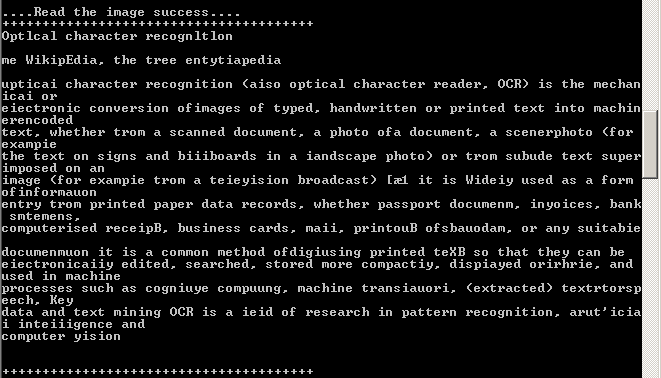

# Example read words from Images with Tesseract.js

## What's Tesseract.js

* Tesseract.js is a pure javascript library for OCR ([Tesseract OCR engine.](https://github.com/tesseract-ocr/tesseract)) 
* It gets words out of images (supports over 60 languages) 
* It can run either in a browser and Node.js.
* Demo ([see](http://tesseract.projectnaptha.com/))

## Use on browser

Include library __tesseract.js__ in HTML
 
```
<script src='https://cdn.rawgit.com/naptha/tesseract.js/1.0.10/dist/tesseract.js'></script>
```
### Example code

```
Tesseract.recognize(imgObj, {
	lang: langValue    
})
.progress(function(p){
	console.log('progress', p)
})
.then(function(result){	
	console.log("Read the image success");		
	/*To do something*/			
})
.catch(function(err){
	console.log("Read the image failed");
	/*To do something*/			
})
.finally(function(resultOrError){		
	console.log("Finally");
	/*To do something*/
});
```

__imgObj__ is any ImageLike object.([see](https://github.com/naptha/tesseract.js#imagelike))

__langValue__ is a property to config a language.([see](https://github.com/naptha/tesseract.js/blob/master/docs/tesseract_lang_list.md))

How to detect the language

```
Tesseract.detect(myImage)
.then(function(result){
    console.log(result.script)
})
```

(then, progress, error and finally methods  can be used)

[My source codes on Browser](index.html)

### Use on Node.js

Install __tesseract.js__ package  with __npm__

```
npm install tesseract.js --save
```

(requires node v6.8.0 or greater.)

Use it:

```
let Tesseract = require('tesseract.js')
```

### Example code 1

I use a picture for testing from [wiki](https://en.wikipedia.org/wiki/Optical_character_recognition)

[My source codes on Node.js](test_ocr.js) and run with this command

```
node test_ocr.js
```

example output




## More example codes and API docs on GitHub.

* https://github.com/naptha/tesseract.js#tesseractjs

##References

* https://github.com/naptha/tesseract.js#tesseractjs
* http://tesseract.projectnaptha.com/
